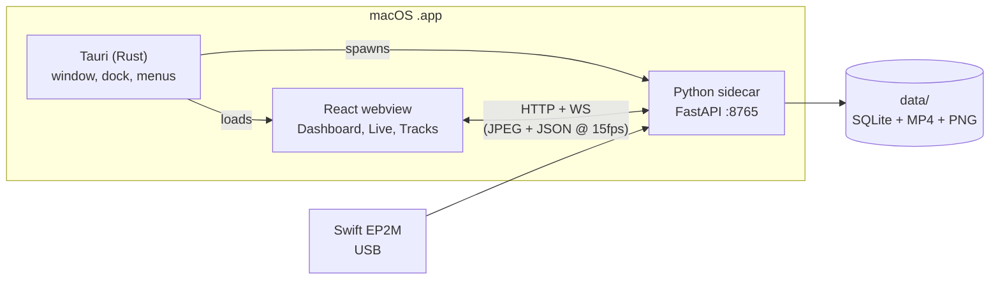
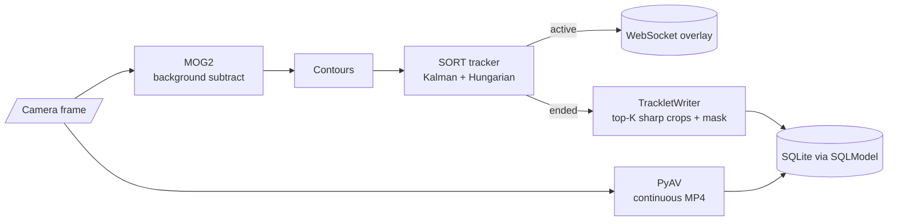

# microorganism-classifier

A local macOS desktop app for live microscope capture, organism tracking, and manual labelling.

## Setup

```bash
just install      # uv sync + bun install
just db-migrate   # apply alembic migrations
just check-camera # verify EP2M is visible to OpenCV
just dev          # run the full app
```

If the camera does not appear, open Photo Booth first. If Photo Booth sees it
but OpenCV does not, grant your terminal Camera access in System Settings >
Privacy and Security > Camera.

## Developing without the camera

To work on the pipeline without the EP2M plugged in, replay bundled microscopy
footage on a loop instead of opening the device.

```bash
just dev 1                  # full app, bundled fixture
just dev /path/to/clip.mp4  # full app, your own clip
just sidecar 1              # backend only, bundled fixture
```

The argument is the `MICRO_DEV_VIDEO` flag. `1` replays the bundled fixture, a
path replays that file, and the bare `just dev` opens the real camera. The
preview streams as soon as the app opens, tracking overlays and recording begin
when you start a run. The fixture and its licence live in `sidecar/fixtures/`.

## Usage

1. Start a session
2. Fill in sample provenance and imaging conditions
3. Watch the live preview, click a bounding box to label that organism
4. End the run, browse saved tracklets, flag interesting ones

## Data layout

```
data/
  app.db
  sessions/session_000001/run_000001/
    recording.mp4         # raw continuous capture
    tracks/track_000123/
      frame_001.png       # top-K sharpest crops
      mask.png
```

## Commands

```bash
just dev           # full app
just sidecar       # backend only
just ui            # frontend only
just check-camera  # OpenCV camera preview
just db-migrate    # alembic upgrade head
just db-revision "msg"  # autogenerate a migration from model diffs
just db-reset      # destroy + recreate (DESTRUCTIVE)
just check         # lint + tsc + cargo check
just build         # bundle the .app
```

## Architecture



